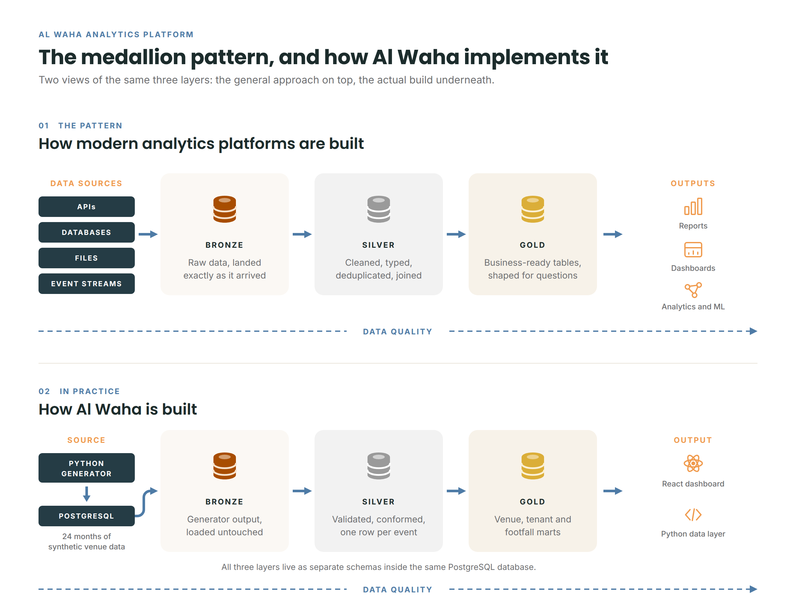

# Al Waha Analytics Platform

An end-to-end analytics build for a fictional Kuwaiti destination operator: seven source systems, deliberately imperfect data, a Python medallion pipeline into a Postgres star schema, and a React dashboard on top.

**[Live dashboard](https://mohammedjouhar.com/al-waha/)** &middot; **[Video walkthrough](https://youtu.be/9J1KSkLrsPQ)** &middot; **[Write-up](https://mohammedjouhar.com/posts/al-waha-analytics-platform)** &middot; **[Why I built it](https://mohammedjouhar.com/posts/footfall-model)**

> All data here is synthetic. Al Waha Park is a fictional business and every figure was generated by code in this repository. It is modelled on the economics of Kuwaiti outdoor destination operators (winter peaking, evening weighted, part landlord and part operator) but is not based on any real company's data.



---

## The problem this models

A destination operator is part landlord and part operator. It leases units to tenants who pay base rent plus a percentage of their sales, and it runs its own venues that take money directly. That creates a genuinely awkward analytics problem:

- Own venues produce clean transactional sales. Tenants self-report their sales monthly, in their own formats, late, and sometimes revised afterwards.
- Different lines of business move on different seasonal curves. The outdoor park collapses in summer; the air-conditioned equestrian arena does not; horse boarding is flat year round.
- Some things are capacity-constrained (riding lesson slots, stables) so utilization matters more than volume, which means modelling what could have happened, not just what did.
- Footfall arrives from gate sensors that fail, double-count, and name the same gate three different ways across vendor exports.

The project builds one trustworthy view over all of it, where every number can be traced back to the source file it came from.

## Architecture

```
7 synthetic sources  ->  Bronze  ->  Silver  ->  Gold  ->  Dashboard
(ERP, footfall,         (raw,      (conformed, (star      (static JSON
 tenant sheets,          untouched, typed,      schema:     export of gold)
 web, weather,           file       flagged,    7 facts,
 contracts, lessons)     registry)  never       11 dims)
                                    dropped)
```

All three layers live as separate schemas inside the same Postgres database.

**Bronze** stores every source file exactly as received, plus a file registry (filename, load time, row count, checksum). Nothing is cleaned here, so there is always a record of what a client actually sent.

**Silver** conforms, types, deduplicates and quality-flags. Nothing is silently dropped: refunds stay as negative rows, duplicates are flagged not deleted, a dead sensor's hours are imputed and labelled, tenant filings are versioned.

**Gold** is the star schema the dashboard reads. Seven fact tables spanning four types (transaction, versioned, periodic snapshot, aggregate, coverage) and eleven dimensions, including an SCD Type 2 tenant dimension so history survives category changes and closures.

## The star schema

| Fact table               | Grain                    | Type              |
| ------------------------ | ------------------------ | ----------------- |
| `fact_pos_sales`         | one invoice line         | transaction       |
| `fact_bookings`          | one booking              | transaction       |
| `fact_footfall`          | gate x hour              | transaction       |
| `fact_tenant_sales`      | tenant x month x version | versioned         |
| `fact_membership_months` | contract x month         | periodic snapshot |
| `fact_web_sessions`      | date x channel x device  | aggregate         |
| `fact_lesson_slots`      | one lesson slot          | coverage          |

Gym memberships and horse boarding share `fact_membership_months` because they are structurally the same thing: a member-month recurring stream with churn.

## The dashboard

A React and TypeScript single page app reading a static JSON export of the gold views. Six sections covering the twelve locked metrics:

| Section                   | Metrics      | What it answers                                                                                  |
| ------------------------- | ------------ | ------------------------------------------------------------------------------------------------ |
| Site plan                 | 1, 3, 4      | An interactive map of the estate: which units trade well, where the footfall enters              |
| Footfall and sales        | 1, 2, 7, 10  | Daily visitors against last year with weather, revenue per visitor, event ROI, transaction value |
| Leasing                   | 3, 4         | Turnover rent owed, sales per square metre, how late tenants file                                |
| Online                    | 5, 6         | Online versus walk-in mix, conversion by acquisition channel over time                           |
| Membership and equestrian | 8, 9, 11, 12 | Recurring base and churn, revenue mix, lesson utilization, stable occupancy                      |
| Data quality              | -            | Every check result, and a census of every source imperfection with what was done about it        |

**No charting library.** The charts are hand-built SVG on about 150 lines of shared primitives (`app/src/lib/chart.ts`: a linear scale, a path builder, round axis ticks, a nearest-point lookup). A dependency larger than the dashboard sitting between the gold data and the marks on screen is a thing you then have to explain.

Every chart ships a table twin, colour is assigned per entity rather than per rank so filtering never repaints a series, and the categorical palette is validated for colour-vision deficiency rather than chosen by eye.

The data quality section opens with the imperfection census, not the passing checks. A page that leads with a wall of green invites the wrong conclusion: the checks pass because the mess was handled, not because the data was clean. A tenant under-reporting every month passes every check on that page.

### What it finds

The generator plants findings that only surface if the modelling is right:

- **A tenant under-reporting sales.** Little Explorers Toys sits 44% below the estate median per square metre, while its monthly sales still track site footfall at 0.93 against a 0.90 peer average. Low level with a normal seasonal shape is what reporting a fixed fraction looks like from outside the tenant's till. The dashboard derives this from the reported figures; nothing reads the generator's answer key.
- **A paid channel quietly dying.** Paid social conversion falls 50% across the two years while organic, direct and referral all rise, and its session volume never drops. It looks healthy on any report that counts traffic.
- **An event that lost money.** Spring Break Kids Week 2025 drew 1,109 extra visitors a day and sold 109 KWD a day *less* than a normal day.
- **A timetable worth changing.** Through peak season beginner riding lessons run at 99 to 100% of capacity and overbook 122 slots rather than turn bookings away, while advanced lessons never clear 55% in any month of two years.

### A note on grain

Three of the six sections needed a reporting view rebuilt at a finer grain before the finding was visible at all. The whole-history conversion view said paid social converts worse than organic, which is true and nearly useless; only a monthly grain shows it collapsing. The same happened with lesson utilization. **A view that answers a metric's wording can still fail the question behind it**, which turned out to be the most portable lesson in the build.

## Deliberate data quality problems

The generator injects realistic flaws so the pipeline has something real to solve:

- A footfall sensor dead for 48 hours (imputed and flagged)
- A sensor double-counting for two weeks (outlier detection that respects seasonality, see note below)
- Gate names as `Gate 1`, `GATE_1`, `G1` across files (conformed)
- Duplicate POS lines from re-export overlap (flagged)
- Refunds as negative quantities (kept, not netted)
- Tenant sales in varying formats, 5 to 40 days late, some restated (versioned to one grain)
- Null contract end dates (churn inferred)
- Duplicate member identities across gym and stable systems (resolved on phone number)

### A note on the outlier rule

The first version of the footfall outlier detection compared readings against a rolling median across mixed day types. Because weekend footfall legitimately runs about 1.6x weekday footfall, it flagged genuine Friday peaks as sensor faults and quietly reduced real peak-season trading. It was rebuilt to compare like with like (same gate, same hour, same day type). This is documented because it is the most instructive bug in the project: a statistical rule applied without domain knowledge will confidently destroy the signal it was meant to protect.

## Tech stack

**Data:** Python 3, pandas, Postgres (Supabase).
**Dashboard:** React 19, TypeScript, Vite. No charting library.

No Spark, no dbt, no orchestration framework, no live ERP connection. The transformations are hand-written on purpose: medallion layers, grain, SCD Type 2 and quality gates are concepts worth implementing by hand before reaching for the managed versions.

### On AI assistance

Most of the code here was written with Claude Code as a pair programmer, which made the build dramatically faster. The business rules were not: the seasonality curves, the Kuwaiti weekend, the capacity model, the reconciliation logic between reported sales and footfall share all came from domain knowledge, and the outlier bug above is what happens when generated code runs ahead of it. The working rule throughout was that nothing gets committed that cannot be explained line by line.

## Running it

```bash
pip install -r requirements.txt
# create a .env file containing DATABASE_URL=postgresql://...
python generator/generate.py     # writes ~2 years of messy source files to data/bronze/
python pipeline/run.py           # bronze -> silver -> gold, with data quality checks
pytest                           # transform tests
```

The pipeline is idempotent: re-running skips unchanged files on checksum match and does not duplicate rows.

### The dashboard

```bash
python -m pipeline.export_dashboard_data   # gold views -> app/public/data/*.json
cd app
npm install
npm run dev                                # http://localhost:5173
npm run build                              # static bundle in app/dist/
```

The exported JSON is committed to the repository rather than gitignored. It has to be: the static host builds the dashboard with no database credentials and no network path to Postgres, so if the JSON is not in the checkout there is nothing to deploy. The build output is fully static, needs no server, and uses relative asset paths so it works from a domain root or a subpath.

## Known limitations

- **Full rebuild is slow.** A complete run takes around 76 minutes against a free-tier Postgres in Mumbai, dominated by network round trips rather than compute. Production would load incrementally (changed day only, in seconds); incremental loading is the next planned piece.
- **The dashboard reads a static export**, not the live database, because the demo data is fixed and a public page should not depend on a database staying awake. The same frontend points at a live warehouse for a real deployment.
- **Rent collected is not modelled.** No payments source exists, so the leasing section ships turnover rent owed with a printed caveat rather than inventing a collection figure.
- **Verification is retrospective.** The bugs found in this build, and the three reporting views rebuilt at a finer grain, were all caught by checking output after the fact. Writing tests before transforms would narrow the gap between "passed its tests" and "actually correct".

## Repository layout

```
config/       client YAML and schema DDL
generator/    synthetic source data generation
pipeline/     extract, transform, load, data quality, dashboard export
sql/          gold views and reporting aggregates
app/          React dashboard (src/lib = data shapes and aggregation,
              src/components/charts = hand-built SVG charts)
docs/         architecture and design notes
tests/        transform tests
```

## One template, many clients

Everything client-specific lives in `config/client_waha.yml`: the business name, currency, weekend days, brand colour, seasonality curves, source file patterns and field mappings, the site plan geometry, and which of the twelve metrics are switched on. The pipeline and the dashboard read that config; neither contains the string "Al Waha" as a hardcoded value.

A different client is a new YAML file plus mappings for any source format not already in the shared library. Rebranding the dashboard is a colour and a name in config, not a code change, which is a thing worth demonstrating live in a meeting.
